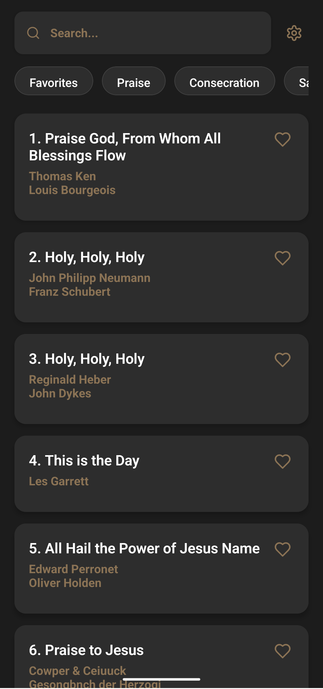
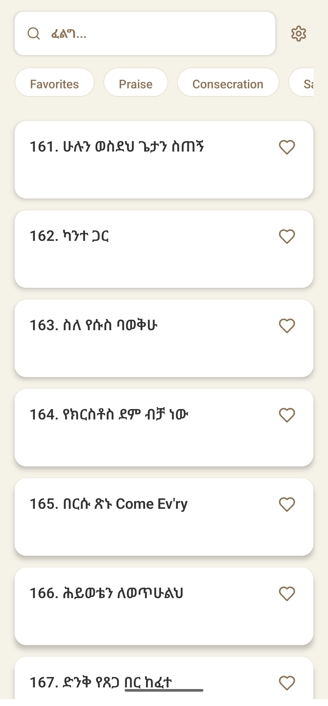
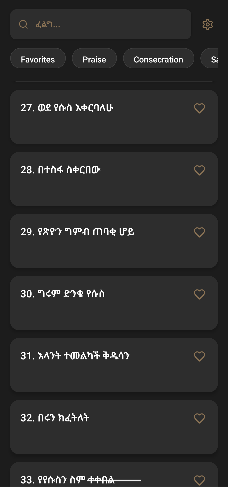
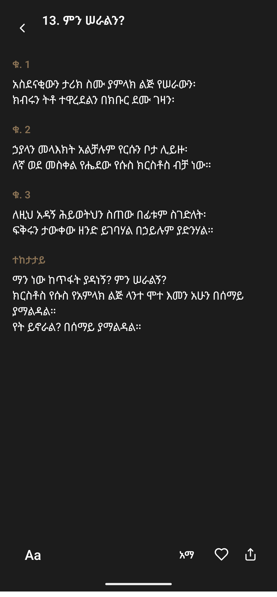

<p align="center">
  <a href="https://play.google.com/store/apps/details?id=com.mesgana.app" target="_blank">
    
  </a>
  <a href="https://play.google.com/apps/testing/com.mesgana.app" target="_blank">
    
  </a>
</p>
<p align="center">
  <b>Note:</b> Access to closed testing requires your Google account to be added as a tester. Please contact the project maintainer to request access.
</p>

# Mesgana - Multilingual Hymnal App

<p align="center">
  
</p>

A cross-platform mobile application for browsing and reading Ethiopian hymns in both Amharic and English. Built with React Native and Expo, Mesgana provides an intuitive interface for discovering, searching, and organizing your favorite hymns.

## 🌟 Features

- **Bilingual Support**: Full Amharic and English language support with seamless switching
- **Smart Search**: Search by title, author, or lyrics content across both languages
- **Category Filtering**: Browse hymns by categories (Praise, Consecration, Salvation, Nature, Trust)
- **Favorites System**: Mark and filter your favorite hymns with persistent storage
- **Dynamic Theming**: Automatic theme switching with manual override (Light/Dark/System)
- **Responsive Design**: Optimized for both mobile and tablet devices
- **Offline Access**: All hymn data is bundled with the app for offline use
- **Accessibility**: Adjustable font sizes (12-24px range) and high contrast themes
- **Native Sharing**: Share app links and hymn content directly from the app

## 📱 Screenshots

<p align="center">
  
  
  
  
</p>

## 🛠️ Technologies Used

### Mobile App

- **React Native** - Cross-platform mobile development
- **Expo** - Development platform and build tools
- **Expo Router** - File-based routing system
- **TypeScript** - Type-safe development
- **Zustand** - Lightweight state management with persistence
- **AsyncStorage** - Local data persistence
- **Lucide React Native** - Beautiful icon library
- **React Native Reanimated** - Smooth animations

### Web Presence

- **HTML5/CSS3** - Static website with responsive design
- **JavaScript** - Interactive elements and theme switching
- **Vercel** - Deployment and hosting

## 🧪 Testing

- **Android Play Store (Closed Testing):** [https://play.google.com/store/apps/details?id=com.mesgana.app](https://play.google.com/store/apps/details?id=com.mesgana.app)
- **Web Closed Testing:** [https://play.google.com/apps/testing/com.mesgana.app](https://play.google.com/apps/testing/com.mesgana.app)

## 🚀 Getting Started

### Prerequisites

- Node.js (v18 or higher)
- npm or yarn
- Expo CLI (`npm install -g @expo/cli`)

### Installation

1. **Clone the repository**

   ```bash
   git clone https://github.com/mk1316/mesgana.git
   cd mesgana
   ```
2. **Install dependencies**

   ```bash
   cd mobile
   npm install
   ```
3. **Start the development server**

   ```bash
   npm run dev
   ```
4. **Run on device/simulator**

   - Scan the QR code with Expo Go app (iOS/Android)
   - Or press 'i' for iOS simulator, 'a' for Android emulator

### Building for Production

```bash
# Build for iOS
eas build --platform ios

# Build for Android
eas build --platform android

# Build for web
npm run build:web
```

## 🤝 Contributing

1. Fork the repository
2. Create a feature branch (`git checkout -b feature/amazing-feature`)
3. Commit your changes (`git commit -m 'Add amazing feature'`)
4. Push to the branch (`git push origin feature/amazing-feature`)
5. Open a Pull Request

## 📄 License

This project is licensed under the MIT License - see the [LICENSE](LICENSE) file for details.

## 📞 Contact

- **Email**: support@mesgana.com
- **GitHub**: [https://github.com/mk1316/mesgana](https://github.com/mk1316/mesgana)
- **App Store**: Coming soon
- **Play Store**: [https://play.google.com/store/apps/details?id=com.mesgana.app](https://play.google.com/store/apps/details?id=com.mesgana.app)
- **Android Closed Testing**: [https://play.google.com/apps/testing/com.mesgana.app](https://play.google.com/apps/testing/com.mesgana.app)
